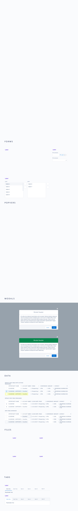
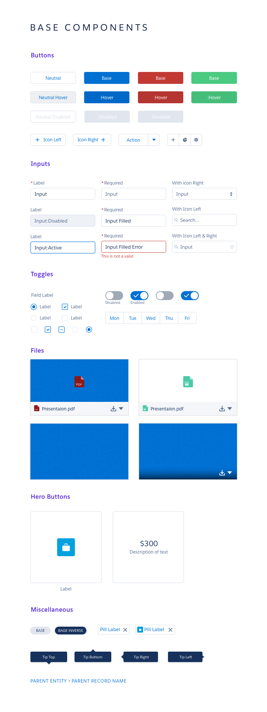
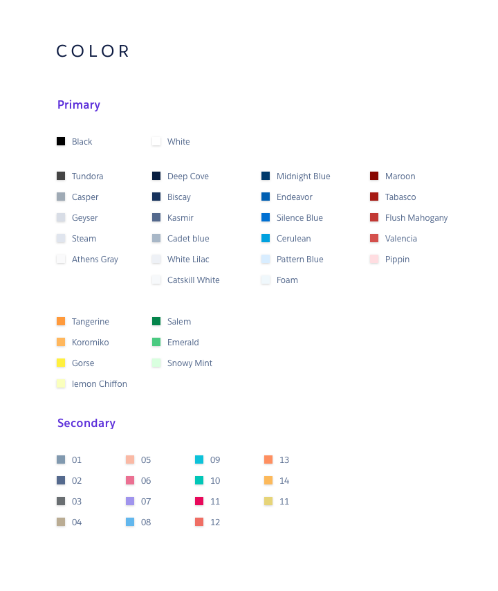
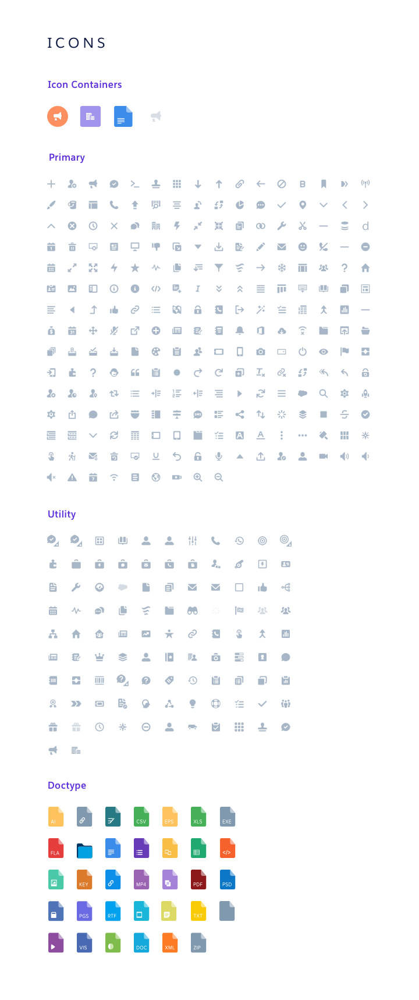
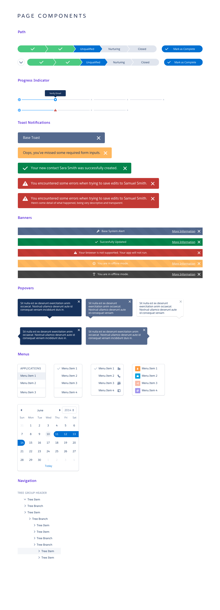

# Artboards

This is an autogenerated file showing all the artboards. Do not edit it directly.

## Artboard

## Badge

## Banner

## Base Components

## BreadCrumb

## Button

## Colors

## Container

## Datepicker

## File

## Form

## Icon-Container

## Icons

## Icons

## Menu

## Modal

## Multi-Select

## Page Components

## Path

## Pill

## Popover

## Progress Indicator

## Table

## Tabs

## Text

## Toast

## Toggle

## Tool-Tip

## Tree

## Z_Styles

